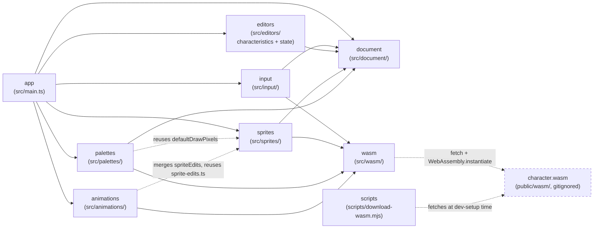

> Generated by /vibe:docs — manual edits will be overwritten; use README for hand-written content.

# Architecture

## Big picture

`character-editor` is a static, backend-less site. All character parsing
happens client-side, in the browser, through a WebAssembly module built from
the sibling [`character`](https://github.com/openkakutou/character) Go
library — this repo never reimplements `.def`/`.air`/`.sff`/`.cns` parsing
itself.

- **`app`** (`src/main.ts`, `src/version.ts`, `src/style.css`) — the entry
  point. Builds the root layout (the org's shared `@openkakutou/web-ui-kit`
  app shell: a toolbar plus a main content region), mounts the `input`
  module's view into it, wires its load callback to `document`'s store, and
  mounts `editors`' characteristics editor and state editor, `sprites`'
  sprite browser, and `palettes`' palette editor once a character loads.
- **`editors`** (`src/editors/`) — screens that edit an already-loaded
  character. `characteristics-editor.ts` renders the first one: a form for
  the top-level identity, referenced-file-path, and list (state files,
  palettes) fields, committing every edit straight into `document`'s store
  via an injected `onChange` callback rather than importing the store
  directly — kept decoupled and testable the same way `input` never touches
  `document` either, only `app` wires the two together. Its text fields are
  plain `<input>`s styled with `web-ui-kit` tokens, not a `web-ui-kit`
  component — see "Native form inputs" below. `state-editor.ts` (item 007)
  is the state/combat logic editor — see "Data flow: editing state/combat
  logic" below and
  `.vibe/decisions/006-state-editor-unsupported-controller-and-removal-scope.md`.
- **`input`** (`src/input/`) — the character file input. `character-file-input.ts`
  holds the DOM-free logic: it accumulates files across any number of
  picker/drop gestures into 6 slots — 4 required (`.def`/`.air`/`.sff`/`.cns`)
  and 2 optional (`.cmd`/`.zss`, not parsed by this app yet, only captured
  — see "Required vs. optional files" below) — validates them (missing
  required kind, same-gesture duplicate kind, unreadable file), and calls
  into `wasm` once the 4 required kinds are present. `character-file-input-view.ts`
  renders the file-picker + drag-and-drop UI on top of that logic.
- **`document`** (`src/document/`) — the in-memory representation of the
  currently loaded character (`character-document.ts`): the WASM-parsed
  data, the raw bytes of every file the user supplied, and now a pending
  `spriteEdits` overlay (see `sprites` below). A plain module-level
  get/set store, not a class — the single place later editor screens
  (palettes, animations, state logic, commands) will read from and
  eventually write back to.
- **`sprites`** (`src/sprites/`) — the sprite browser: browse every sprite
  group/image with a zoom/pan preview (`web-ui-kit`'s `<wuik-viewport>`),
  import a new image as a sprite, replace an existing one's pixels, or
  delete one. `sprite-edits.ts` is the DOM-free pure logic (merging pending
  edits onto the WASM-parsed sprite list for display, reference counting
  for the delete warning); `image-decode.ts` decodes a picked file into raw
  pixels (`createImageBitmap` + a throwaway canvas); `sprite-browser.ts` is
  the Web Component-ish DOM layer, committing edits into `document`'s
  `spriteEdits` overlay via an injected `onSpriteEdit` callback, the same
  decoupling `editors` already established. Persisting these edits into a
  real `.sff` file is out of scope for now — see
  `.vibe/decisions/004-sprite-edits-in-memory-overlay-not-persisted.md`.
- **`wasm`** (`src/wasm/`) — the bridge to the `character` WebAssembly
  module. `bridge.ts` loads `wasm_exec.js` and instantiates `character.wasm`
  client-side (both fetched from `public/wasm/`, which is gitignored — see
  "WebAssembly dependency" below), then exposes typed wrappers around the
  module's `OpenKakutouCharacter.load` (`loadCharacter`) and
  `resolveSprites` (`resolveSpritePixels`, sprite pixel decoding for
  `sprites`) globals. `types.ts` is the TypeScript mirror of the module's
  JSON contract (`CharacterData` and its nested shapes, including the full
  `.def` metadata — author, referenced file paths, state files, palettes)
  — pure data types, no parsing logic.
- **`palettes`** (`src/palettes/`) — the palette editor. `palette.ts` is the
  DOM-free pure logic: a 256-color palette stored in **semantic MUGEN
  index order**, and the one `reversePaletteByteOrder` function (a
  mathematical involution) that converts to/from a real `.act` file's raw
  byte layout, since the `sff` Go library's own decode reverses index
  order (raw file position `i` holds semantic index `255-i`) — see
  `.vibe/decisions/005-palette-model-semantic-index-order-shared-reversal.md`.
  `palette-editor.ts` is the DOM layer: a 256-swatch grid, a
  `<wuik-color-picker>`-driven detail panel for the selected color, and a
  live-recolored sprite preview built by passing the current palette's
  file-order bytes as `wasm.resolveSpritePixels`'s override argument —
  reusing `sprites`' own `defaultDrawPixels` rather than duplicating it.
- **`animations`** (`src/animations/`) — the animation editor: create/edit
  `.air` animations, their frames (sprite reference, duration), and each
  frame's Clsn1/Clsn2 (hit/hurt) boxes, plus a play/pause/step preview.
  `animation-logic.ts` is the DOM-free pure logic (frame/box construction,
  Clsn move/resize geometry, integer-pixel snapping, sprite-reference
  existence checks against the merged `sprites` overlay);
  `animation-playback.ts` is the equally DOM-free frame-advance/looping/
  hold logic the playback timer drives. `animation-editor.ts` is the DOM
  layer — see "Data flow: editing animations" below and
  `.vibe/decisions/007-animation-editor-clsn-interaction-model.md` for why
  Clsn boxes are numeric-input-first with drag/keyboard as equivalent
  paths, slotted inside `<wuik-viewport>` rather than a separate overlay
  layer.
- **`scripts`** (`scripts/download-wasm.mjs`) — dev-only tooling, not part
  of the shipped app bundle. Fetches a pinned `character` release's
  `character.wasm` + `wasm_exec.js` into `public/wasm/` so contributors
  don't need a Go toolchain or a sibling `character` checkout.

## Required vs. optional input files

The WebAssembly module's `load` call hard-requires exactly 4 byte buffers
(`.def`/`.air`/`.sff`/`.cns`) — it has no parse call yet for `.cmd`/`.zss`.
A real character also uses `.cns` **or** `.zss` for combat logic, never
both, and `.cmd` is common but not universal. So `.cmd`/`.zss` are optional
input slots: their raw bytes are captured into `document`'s store for a
later editor item to use, but never parsed or validated by this app today.
See `.vibe/decisions/002-required-vs-optional-input-files-and-in-memory-document.md`.

## Native form inputs

`web-ui-kit` has no generic text-input/form-field component yet (only
specialized ones — a slider, a color picker — plus `wuik-button`). The
characteristics editor's text fields are plain `<input>`/`<label>`
elements styled directly with `web-ui-kit`'s `--wuik-*` tokens, reusing
that design system's own documented invalid-state contract (`is-invalid`
class, `aria-invalid`, a danger-colored border, inset focus ring) so the
screen still reads as part of the same system. Buttons (list row add/
remove) stay real `wuik-button` elements, since that component already
exists. See `.vibe/decisions/003-characteristics-editor-scope-and-native-inputs.md`
and follow-up backlog item `013` (migrate once a real component ships).

## WebAssembly dependency

`public/wasm/` (the `character.wasm` binary and its `wasm_exec.js` loader)
is fetched, never committed — see `docs/development.md` for how to fetch it
locally. Once fetched, `wasm/bridge.ts` loads `wasm_exec.js` by executing
its source via `new Function(source)()` rather than a `<script>` tag or
`import()`, so the same loading code behaves identically in a real browser
and under the test suite's jsdom environment.

## Data flow: loading a character

1. The user picks or drops files onto `input`'s view.
2. `input`'s logic classifies each file by extension into one of the 6
   slots, and — once the 4 required kinds are filled with no unresolved
   conflict on a required slot — reads every supplied file's bytes (via
   `FileReader`, not `Blob#arrayBuffer()`, since the latter is
   unimplemented in the project's pinned jsdom version and this way test
   and browser behavior match).
3. The 4 required byte buffers are handed to `wasm.loadCharacter`, which
   calls the WebAssembly module's `OpenKakutouCharacter.load` and parses
   its `{character, error}` JSON result into a typed `CharacterResult`.
4. `input`'s view reports success (character loaded) or a typed failure
   (a specific unreadable file, or the WASM module's own parse error) back
   to the caller — never a thrown exception at any layer.
5. On success, `app` stores the loaded `CharacterData` plus every supplied
   file's raw bytes (required and optional) into `document`'s in-memory
   store. Loading a different character later repeats this from step 1 and
   fully replaces the previous document.

## Data flow: browsing and editing sprites

1. `sprites` reads the WASM-parsed sprite metadata (`CharacterData.sprites`)
   and, for a selected sprite with no pending edit, decodes its actual
   pixels on demand via `wasm.resolveSpritePixels` — pixel data is never
   part of `CharacterData` itself, since the WASM `load` JSON contract
   never carries it, only metadata (dimensions, axis, palette index).
2. Importing or replacing decodes the picked file locally
   (`image-decode.ts`, real browser `createImageBitmap`) — no round trip
   through the WASM module, since it exposes no encode/save call yet.
3. Every committed add/replace/delete is merged onto the base sprite list
   purely in `sprite-edits.ts` for display, and reported to `app` via
   `onSpriteEdit`, which appends it to `document`'s `spriteEdits` array.
   Loading a different character resets `spriteEdits` to empty, the same
   "a fresh load starts clean" rule the rest of the document follows.
4. Nothing here writes to a real `.sff` file yet — a later item does that,
   consuming `spriteEdits` once the `sff` module's own WASM build exposes
   an encode call.

## Data flow: editing a palette

1. `palettes` starts with no active palette; the user either starts one
   blank (`blankPalette()`, all-black) or uploads an existing `.act` file
   (`parseActBytes`, which normalizes both the exact 768-byte layout and
   the common 772-byte Adobe-trailer variant, converting file order to
   semantic order in the same step).
2. Selecting a swatch and editing it via the `<wuik-color-picker>` updates
   only that one color (`withColor`, an immutable update) and the one
   affected swatch's own DOM — the picker element itself is never
   rebuilt, so an in-progress interaction on it survives every edit.
3. Every edit re-triggers a live preview: `serializeActBytes` (the same
   `reversePaletteByteOrder` conversion used for real `.act` export) turns
   the current palette into the file-order bytes `wasm.resolveSpritePixels`
   expects as its override argument, decoding the chosen preview sprite
   recolored with the edited palette.
4. "Save as .act" downloads `serializeActBytes(activePalette)` via a
   throwaway object URL — this, unlike sprite edits, is not staged into
   `document`'s store, since the acceptance criteria only ask for a
   standalone downloadable file, independent of the full character
   save/export item (`009`).

## Data flow: editing state/combat logic

1. `state-editor.ts` reads `CharacterData.stateDefs` — a `character/cns`
   `[Statedef N]` block plus its ordered `Controller` list, each controller
   an unevaluated `{type, triggers, parameters}` this app only edits, never
   interprets. StateDefs render as collapsible panels (mirroring the same
   collapsed-by-default convention `sprites`' group list uses); a panel's
   header shows its number and header fields read-only — editing those
   fields is out of this item's scope.
2. Each committed edit (a controller's type/trigger/parameter, an add/
   remove/reorder, or a whole StateDef's add/remove) rebuilds that
   StateDef's `controllers` array (or the top-level `stateDefs` array) and
   calls `options.onChange({stateDefs})` — the same "commit a patch,
   never touch the document store directly" convention `characteristics-editor.ts`
   established.
3. A controller is classified "unsupported" — read-only, flagged, but still
   removable — only if its `type` was already blank in the data as loaded;
   this is computed once per row and never re-derived from a live edit, so
   editing a type field can never lock or unlock that same row out from
   under the user. See `.vibe/decisions/006`.
4. Removing a single controller commits immediately; removing a whole
   StateDef shows an inline confirm/cancel step first, naming how many
   controllers would go with it — the same "confirm a broad-blast-radius
   delete" precedent `sprites`' delete-confirmation established, applied
   here without that screen's reference-count computation (not requested by
   this item's acceptance criteria).
5. Move-up/move-down reorder a StateDef's `controllers` array directly;
   each handler is guarded against running past the list boundary in its
   own code, not solely via its button's `disabled` attribute — found by
   real-browser runtime verification, where a forced/synthetic click on a
   boundary button (never possible via genuine mouse interaction, since a
   disabled real `<button>` inside `wuik-button`'s shadow DOM never
   dispatches a click at all) would otherwise swap in `undefined` and
   crash the next commit.

## Data flow: editing animations

1. `animations` reads `CharacterData.animations` (each a `.air`
   `[Begin Action N]` block: a number, an ordered `Frame` list, and a loop
   point) and renders them the same collapsible-panel pattern `sprites`'
   group list and `state-editor`'s StateDef list already established.
2. A frame's sprite reference is checked against the **merged** sprite
   list — `character.sprites` plus the sprite browser's own pending
   `spriteEdits` overlay (`sprite-edits.ts`'s `mergeSpriteGroups`, reused
   directly rather than reimplemented) — so a sprite added or deleted in
   this same session is reflected immediately, not just the WASM-parsed
   snapshot from load time. `app` re-invokes the animation editor's render
   on every sprite-browser edit for exactly this reason; see
   `animation-editor.ts`'s own per-`root` UI-state `WeakMap` for how
   expand/Clsn-panel-open state survives that repeated render.
3. Each Clsn1/Clsn2 box is editable three equivalent ways — numeric x/y/
   width/height inputs, arrow-key nudging (1px, 10px with Shift), or
   pointer drag-to-move/drag-to-resize — all funneling through the same
   `moveClsnBox`/`resizeClsnBox`/`setClsnBoxBounds` pure functions, every
   commit snapped to an integer pixel. A drag mutates the box element's
   own inline style live (no full re-render per `pointermove` — found by
   real-browser runtime verification to be both visibly janky and prone to
   handle staleness with a naive per-move `renderBoxes()` call) and commits
   to the data model once, on `pointerup`.
4. The Clsn box overlay `
`s are DOM children slotted inside the same
   `<wuik-viewport>` as the sprite preview `<canvas>`, not a separately
   positioned layer — `wuik-viewport`'s own pan/zoom CSS transform then
   applies to canvas and boxes alike for free, with no transform-tracking
   code of this app's own to keep in sync.
5. Playback schedules its own timer (real `window.setTimeout` by default,
   injectable) via `animation-playback.ts`'s `advanceFrame`, looping back
   to the animation's `loopStart` once past the last frame; a frame with a
   non-positive `time` (MUGEN's "hold indefinitely" convention) reports
   `holds: true` and stops further auto-scheduling until a manual Step or
   edit moves past it. Starting a Clsn drag or any structural frame/
   animation edit pauses an in-progress playback automatically.
