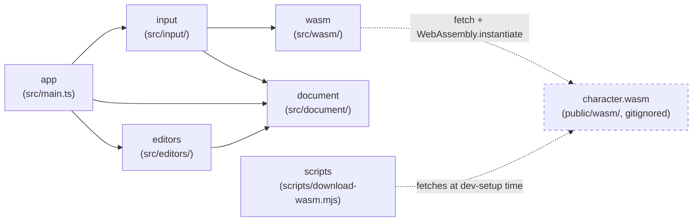

> Generated by /vibe:docs — manual edits will be overwritten; use README for hand-written content.

# Architecture

## Big picture

`character-editor` is a static, backend-less site. All character parsing
happens client-side, in the browser, through a WebAssembly module built from
the sibling [`character`](https://github.com/openkakutou/character) Go
library — this repo never reimplements `.def`/`.air`/`.sff`/`.cns` parsing
itself.

- **`app`** (`src/main.ts`, `src/version.ts`, `src/style.css`) — the entry
  point. Builds the root layout (the org's shared `@openkakutou/web-ui-kit`
  app shell: a toolbar plus a main content region), mounts the `input`
  module's view into it, wires its load callback to `document`'s store, and
  mounts `editors`' characteristics editor once a character loads.
- **`editors`** (`src/editors/`) — screens that edit an already-loaded
  character. `characteristics-editor.ts` renders the first one: a form for
  the top-level identity, referenced-file-path, and list (state files,
  palettes) fields, committing every edit straight into `document`'s store
  via an injected `onChange` callback rather than importing the store
  directly — kept decoupled and testable the same way `input` never touches
  `document` either, only `app` wires the two together. Its text fields are
  plain `<input>`s styled with `web-ui-kit` tokens, not a `web-ui-kit`
  component — see "Native form inputs" below.
- **`input`** (`src/input/`) — the character file input. `character-file-input.ts`
  holds the DOM-free logic: it accumulates files across any number of
  picker/drop gestures into 6 slots — 4 required (`.def`/`.air`/`.sff`/`.cns`)
  and 2 optional (`.cmd`/`.zss`, not parsed by this app yet, only captured
  — see "Required vs. optional files" below) — validates them (missing
  required kind, same-gesture duplicate kind, unreadable file), and calls
  into `wasm` once the 4 required kinds are present. `character-file-input-view.ts`
  renders the file-picker + drag-and-drop UI on top of that logic.
- **`document`** (`src/document/`) — the in-memory representation of the
  currently loaded character (`character-document.ts`): the WASM-parsed
  data plus the raw bytes of every file the user supplied. A plain
  module-level get/set store, not a class — the single place later editor
  screens (characteristics, sprites, palettes, animations, state logic,
  commands) will read from and eventually write back to.
- **`wasm`** (`src/wasm/`) — the bridge to the `character` WebAssembly
  module. `bridge.ts` loads `wasm_exec.js` and instantiates `character.wasm`
  client-side (both fetched from `public/wasm/`, which is gitignored — see
  "WebAssembly dependency" below), then exposes a typed `loadCharacter(...)`
  wrapper around the module's `OpenKakutouCharacter.load` global. `types.ts`
  is the TypeScript mirror of the module's JSON contract (`CharacterData`
  and its nested shapes, including the full `.def` metadata — author,
  referenced file paths, state files, palettes) — pure data types, no
  parsing logic.
- **`scripts`** (`scripts/download-wasm.mjs`) — dev-only tooling, not part
  of the shipped app bundle. Fetches a pinned `character` release's
  `character.wasm` + `wasm_exec.js` into `public/wasm/` so contributors
  don't need a Go toolchain or a sibling `character` checkout.

## Required vs. optional input files

The WebAssembly module's `load` call hard-requires exactly 4 byte buffers
(`.def`/`.air`/`.sff`/`.cns`) — it has no parse call yet for `.cmd`/`.zss`.
A real character also uses `.cns` **or** `.zss` for combat logic, never
both, and `.cmd` is common but not universal. So `.cmd`/`.zss` are optional
input slots: their raw bytes are captured into `document`'s store for a
later editor item to use, but never parsed or validated by this app today.
See `.vibe/decisions/002-required-vs-optional-input-files-and-in-memory-document.md`.

## Native form inputs

`web-ui-kit` has no generic text-input/form-field component yet (only
specialized ones — a slider, a color picker — plus `wuik-button`). The
characteristics editor's text fields are plain `<input>`/`<label>`
elements styled directly with `web-ui-kit`'s `--wuik-*` tokens, reusing
that design system's own documented invalid-state contract (`is-invalid`
class, `aria-invalid`, a danger-colored border, inset focus ring) so the
screen still reads as part of the same system. Buttons (list row add/
remove) stay real `wuik-button` elements, since that component already
exists. See `.vibe/decisions/003-characteristics-editor-scope-and-native-inputs.md`
and follow-up backlog item `013` (migrate once a real component ships).

## WebAssembly dependency

`public/wasm/` (the `character.wasm` binary and its `wasm_exec.js` loader)
is fetched, never committed — see `docs/development.md` for how to fetch it
locally. Once fetched, `wasm/bridge.ts` loads `wasm_exec.js` by executing
its source via `new Function(source)()` rather than a `<script>` tag or
`import()`, so the same loading code behaves identically in a real browser
and under the test suite's jsdom environment.

## Data flow: loading a character

1. The user picks or drops files onto `input`'s view.
2. `input`'s logic classifies each file by extension into one of the 6
   slots, and — once the 4 required kinds are filled with no unresolved
   conflict on a required slot — reads every supplied file's bytes (via
   `FileReader`, not `Blob#arrayBuffer()`, since the latter is
   unimplemented in the project's pinned jsdom version and this way test
   and browser behavior match).
3. The 4 required byte buffers are handed to `wasm.loadCharacter`, which
   calls the WebAssembly module's `OpenKakutouCharacter.load` and parses
   its `{character, error}` JSON result into a typed `CharacterResult`.
4. `input`'s view reports success (character loaded) or a typed failure
   (a specific unreadable file, or the WASM module's own parse error) back
   to the caller — never a thrown exception at any layer.
5. On success, `app` stores the loaded `CharacterData` plus every supplied
   file's raw bytes (required and optional) into `document`'s in-memory
   store. Loading a different character later repeats this from step 1 and
   fully replaces the previous document.
